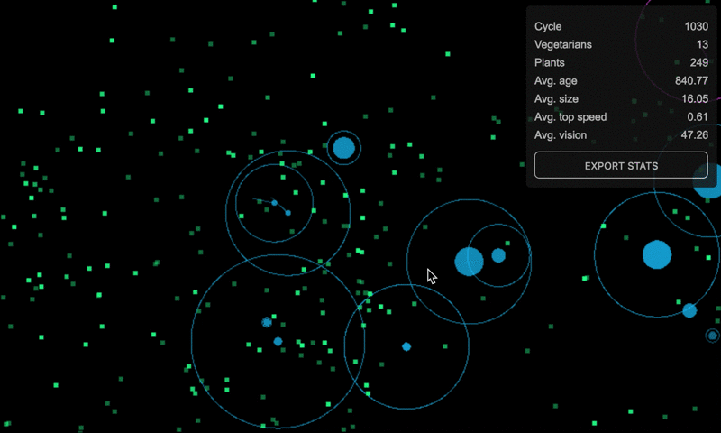
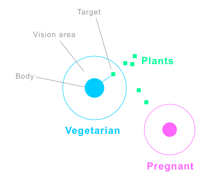

# EVO



EVO illustrates a basic evolutionary ecosystem, with two types of creatures, Vegetarians and plants.



### Vegetarians

They are the rounded blue or pink circular creatures. The vegetarians are able to evolve in time,
having a basic DNA that determines their abilities: "size", "vision" and "speed".

#### Habits

Vegetarians will move randomly through the EVO world trying to find a plant to eat or another vegetarian to procreate.

When a creature is under his vision it becomes a candidate to be the vegetarian target. 
Depending on the vegetarian health he will have appetency for eating or procreate.

The vegetarian health decreases with time and increases when he eats a plant.

#### Reproduction

Reproduction could take place when to individuals collide, if one or both of the vegetarians get pregnant their
color will change from blue to pink. During the fecundation, they will save the DNA of his couple to propagate
it to their unique child.

After the gestation period a new vegetarian will be born, his DNA will be the result of a crossover of his parents DNA's
plus a possible mutation.

### Plants

They have been created to be eaten. Plants aren't able to move but can reproduce sending some spores around their position.

### Running Locally

Install dependencies with yarn

```
yarn
```

Start the local server in [http://localhost:8080/](http://localhost:8080/)

```
yarn start
```

